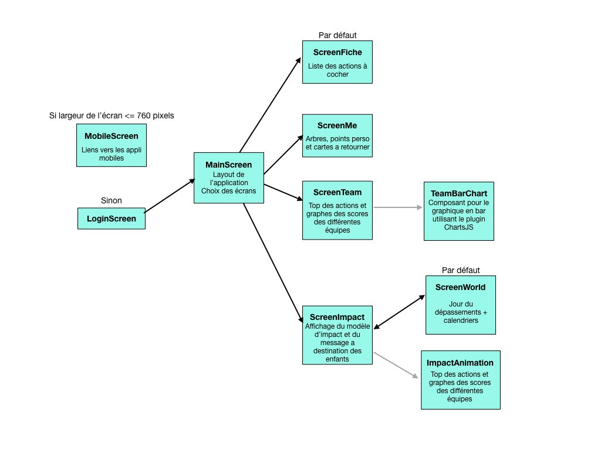

# Nnauru frontend

## Configuration
Ajouter à la racine du projet un fichier .env.local contenant ces constantes :
```
NODE_ENV="production"
VUE_APP_LOCALE="fr-FR"
VUE_APP_API_ROOT=""
VUE_APP_API_IMG_ROOT=""
VUE_APP_THEME="/src/scss/_theme.scss"
VUE_APP_MOBILE_APP_LINK_ANDROID=""
VUE_APP_MOBILE_APP_LINK_IOS=""
```

## Organisation des composants Vue


## CSS
Le CSS est rangé par composant. Les media-queries (pour l'affichage responsive) se trouvent à la fin.

## Thème
Les variables css sont stockées dans un fichier thème (par défaut /src/scss/_theme.scss)

## Langues
Les locale strings sont dans le fichier main.js de la racine du projet.

## Project setup
```
npm install
```

### Compiles and hot-reloads for development
```
npm run serve
```

### Compiles and minifies for production
```
npm run build
```

### Lints and fixes files
```
npm run lint
```
